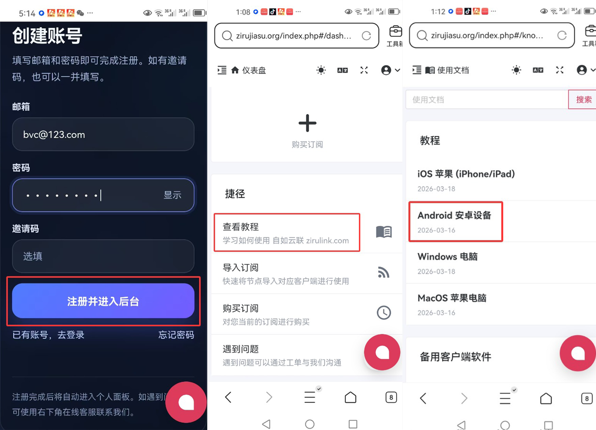
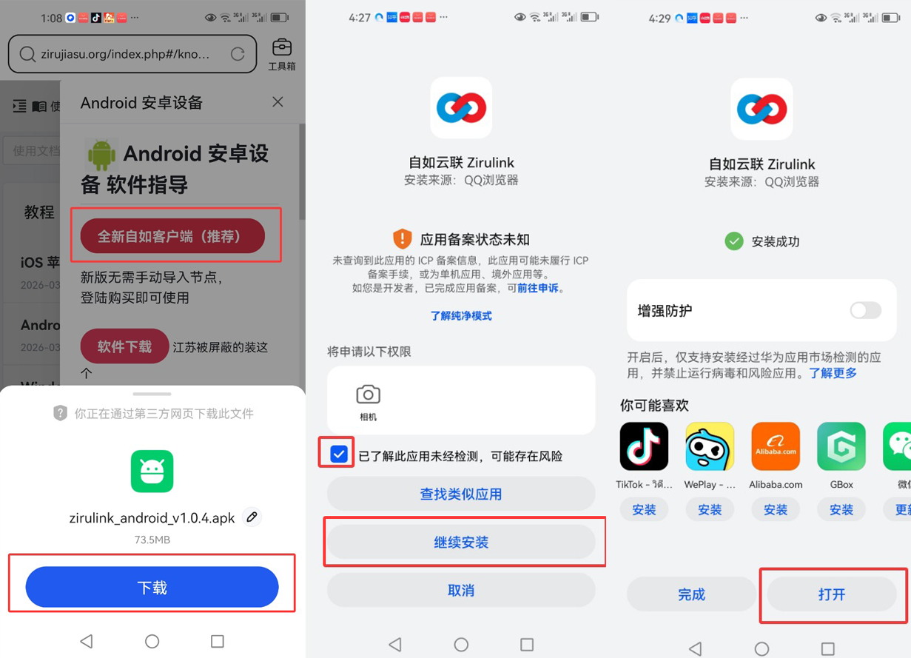
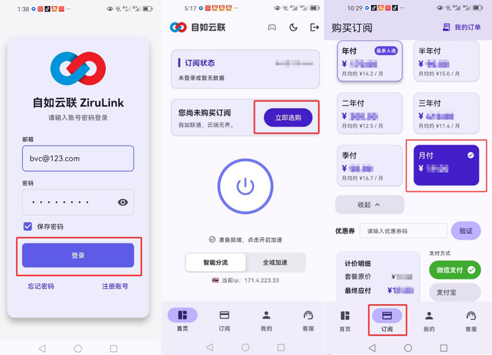

# ZiruLink-Android-Full-Guide
自如加速器 (ZiruLink) 安卓手机端全流程图文使用指南，涵盖注册、下载、购买及 Google 连通性测试。
# 📱 自如加速器 (ZiruLink) 安卓端全流程使用指南

> **自如加速器** 致力于为您提供稳定、极速的海外网络连接体验。本教程将带您完成从官网注册到 Google 搜索测试的全过程。

---

## 📸 图文教程步骤

### 1. 账号注册与后台进入
* **访问官网**：打开手机浏览器输入 **ziru.us**。
* **注册账号**：在注册页面输入常用邮箱并设置密码，点击“注册并进入后台”。
* **查找教程**：进入仪表盘后点击“查看教程”，在文档中心选择 **“Android 安卓设备”**。

---

### 2. 下载与安装客户端
* **获取应用**：在安卓软件指导页面，点击 **“全新自如客户端（推荐）”** 按钮。
* **确认下载**：在弹出的下载提示中点击底部的 **“下载”**。
* **安全授权**：打开安装包，若提示应用未经检测，请勾选 **“已了解此应用...”** 并点击 **“继续安装”**。
* **启动应用**：安装成功后点击 **“打开”** 启动客户端。

---

### 3. 登录与套餐购买
* **账户登录**：在 App 登录界面输入您注册的邮箱和密码进行登录。
* **选购订阅**：点击底部的 **“订阅”** 选项，然后点击 **“立即选购”**。
* **完成支付**：选择适合您的套餐（月付/季付/年付）并完成订单支付。

---

### 4. 一键启动与连通性测试
* **开启连接**：回到 App **“首页”**，点击屏幕中央的 **“启动按钮”**。
* **显示成功**：当显示“连接成功”及当前加密 IP 地址时，加速服务已正式开启。
* **归属地检测**：访问 **ip138.com** 确认您的网络位置已切换至海外节点。
* **流畅度验证**：直接在浏览器输入 **google.com** 进行搜索测试，感受秒开网页的极速体验。

---

## 🔗 相关资源
* **官方网站**: [ziru.us](https://ziru.us)
* **性能监测白皮书**: [巴巴豆安全页面](https://www.babeedu.net/?p=760)
* **GitHub 技术主页**: [janhaas1980-south](https://github.com/janhaas1980-south/janhaas1980-south)

---
© 2026 自如加速器. 保留所有权利。
